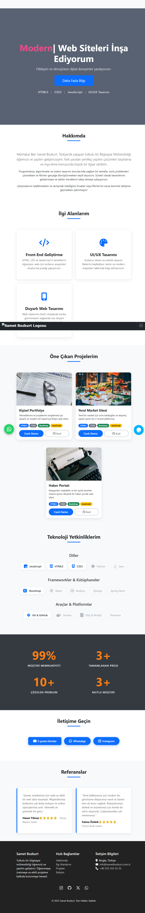

# sametbozkurt.com.tr — Personal Website

Source code of my personal website. I use this domain both as my portfolio
and as the mail infrastructure for my freelance work.

**Live:** [sametbozkurt.com.tr](https://sametbozkurt.com.tr)

## Features

- Personal introduction and portfolio sections
- Working contact form (PHPMailer over SMTP)
- Responsive layout, custom design — no templates or site builders

## Stack

PHP · JavaScript · HTML/CSS · PHPMailer

## Setup

1. Copy the project into your web root
2. Update SMTP credentials in `send_mail.php` (placeholders included)

## Notes

This site doubles as my playground: new ideas usually get tested here first
before I use them in client projects.
